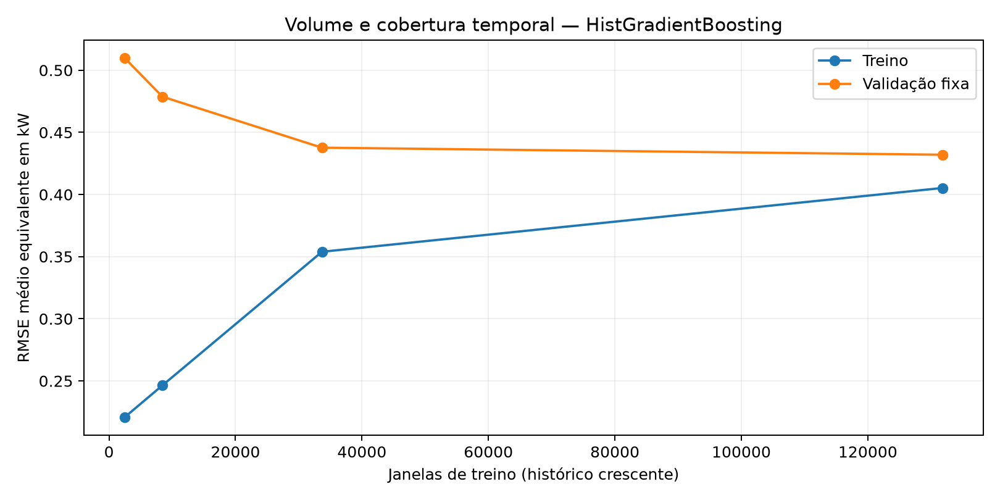
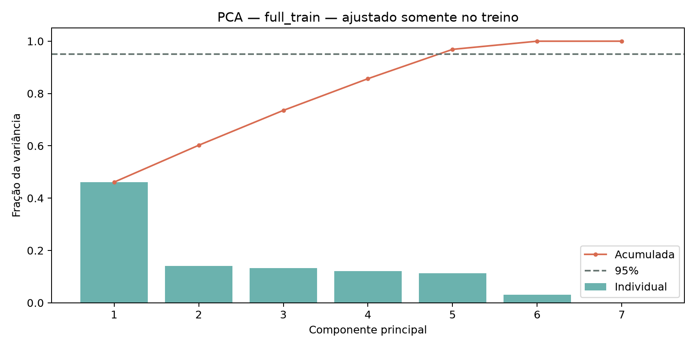
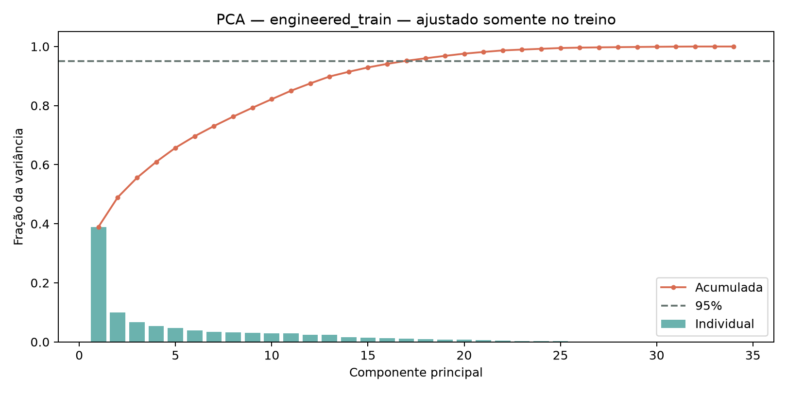
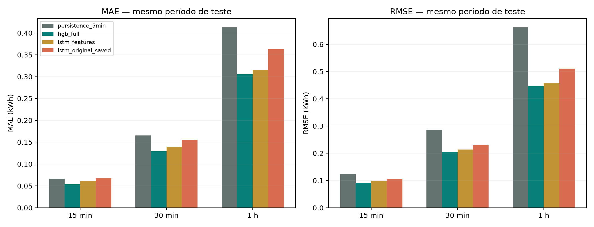
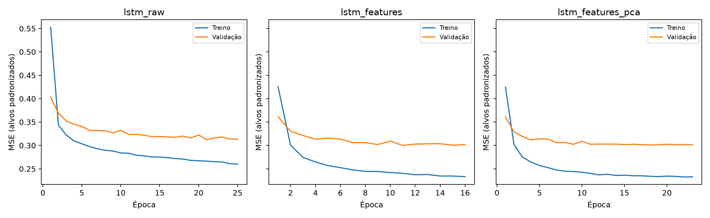
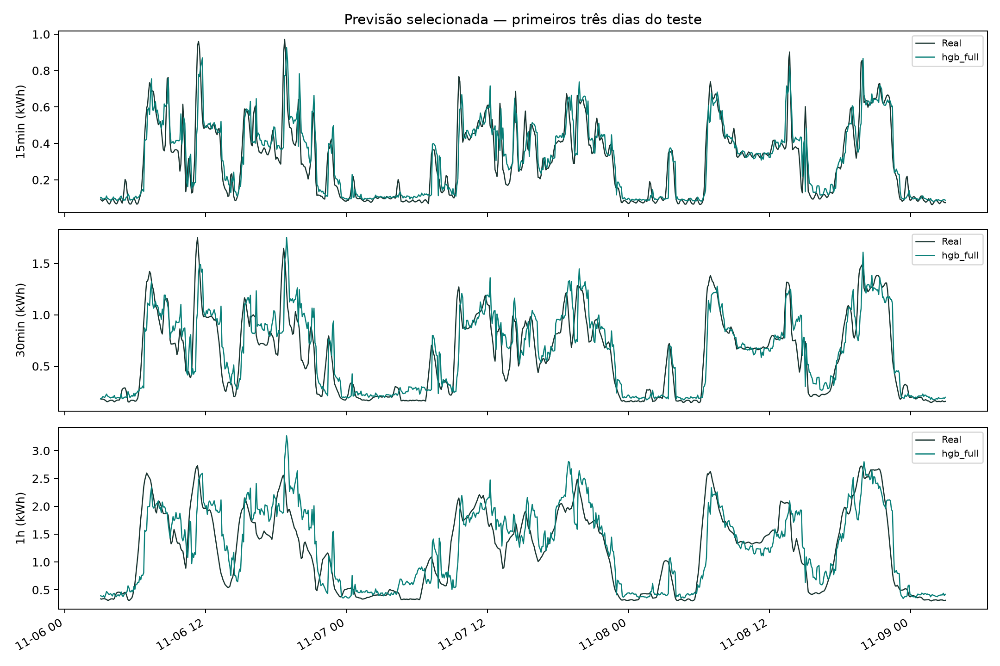

# Diagnóstico e retreinamento da previsão de energia

O modelo selecionado pela validação foi **hgb_full**. A melhor rede foi **lstm_features**.
O teste foi calculado depois de salvar a seleção em `selection.json`.

## O dataset é suficiente?

O arquivo contém **2,075,259 registros**, de 2006-12-16 17:24:00 a 2010-11-26 21:02:00.
Há 25,979 linhas com medições ausentes (1.25%).
A maior lacuna tem **7,226 minutos**, aproximadamente 5.02 dias.
O treino original continha apenas 140,000 minutos
(97.22 dias) e **8.90%** deles eram ausentes antes da interpolação.
O pipeline original interpolava sem limite, inclusive usando valores posteriores.
Também reutilizava um cache truncado e ignorava aumentos de `--max-rows`; esse erro foi corrigido.

Mantendo o mesmo modelo HGB, as mesmas features e o mesmo período de validação:

| history | samples | train_score | validation_score |
| --- | --- | --- | --- |
| 30days | 2515 | 0.2209 | 0.5096 |
| original | 8454 | 0.2464 | 0.4787 |
| 365days | 33681 | 0.3539 | 0.4377 |
| full | 131804 | 0.4053 | 0.4320 |

Passar do recorte original para um ano reduziu o erro de validação em
**8.57%**. Passar de um ano para todo o histórico anterior
à validação trouxe mais **1.30%**.
Isso sustenta usar mais cobertura temporal que o recorte inicial. O ganho marginal menor
depois de um ano sugere retornos decrescentes para esse modelo e essa validação.
**Não demonstra suficiência universal**: quantidade e estações do ano variam juntas nesta curva;
os minutos/janelas se sobrepõem e não são observações independentes.
O conjunto descreve **uma residência**, portanto não permite concluir desempenho em outras casas.
Para uma conclusão mais forte, usar múltiplas validações cronológicas em diferentes estações
e repetir as redes com outras sementes. Novos dados de outras residências seriam necessários
para avaliar generalização entre domicílios.



## Variância, correlação e PCA

Todas as sete medições foram analisadas, além das 34 features de contexto.
Potência ativa e corrente têm correlação **0.998893** no treino completo.
Depois de padronizar cada variável, cinco componentes das sete medidas preservam
**96.87%** da variância e seis preservam
**99.99%**.
Nas features de contexto, **17 componentes** preservam pelo menos 95%.
O PCA é descritivo e não usa os alvos: alta variância explicada não garante menor erro de previsão.
Ele também não mede se o número de registros é suficiente.

O experimento `lstm_features_pca` aplica PCA de 95% **às sete medições da sequência**;
mantém o contexto de engenharia de features. O PCA das features de contexto foi realizado
para diagnóstico, sem reduzi-las automaticamente na rede.
Scaler, imputação das defasagens opcionais e PCA são ajustados exclusivamente no treino.
As estatísticas por variável, variâncias, correlações e pesos dos componentes estão em
`feature_statistics_*.csv`, `correlation_*.csv`, `pca_*.csv` e `pca_*_weights.csv`.




## Mudanças e protocolo

- Alvos: energia efetivamente observada nos próximos 15, 30 e 60 minutos, em kWh.
- Nenhum alvo é interpolado. A linha temporal é mantida; janelas com medições ausentes
  no histórico ou nos 60 minutos futuros são excluídas igualmente dos candidatos novos.
- Histórico da rede: 120 minutos, agrupados em médias de cinco minutos.
- Features: medições atuais, médias móveis, desvio padrão, mínimos/máximos, defasagens,
  consumo no mesmo intervalo do dia/semana anterior, calendário cíclico e carga não submedida.
- Redes: LSTM de 32 unidades, dropout de 10%, Dense 64/32/3, Adam 0,0005,
  clipnorm 1, early stopping e redução de learning rate. As versões com features
  concatenam o contexto à saída da LSTM; a versão raw usa apenas a sequência.
- As três redes usam as mesmas 33,681 janelas de treino
  de até 365 dias, semente 42 e no máximo 25 épocas.
- As previsões neurais recebem a regra física predefinida de energia não negativa e
  acumulada não decrescente entre horizontes, aplicada na validação e no teste.
- Comparação adicional: persistência da potência média dos últimos cinco minutos e HGB.
- Escolha: menor média de `RMSE_kWh / duração_em_horas` na validação, dando peso igual
  aos três horizontes em uma unidade comparável. MAPE é reportado, mas pode aumentar
  muito com consumos pequenos; MAE, RMSE e WAPE complementam a análise.
- Validação: 2010-10-16 05:03:00 a 2010-11-06 01:02:00.
- Teste: 2010-11-06 01:03:00 a 2010-11-26 21:02:00.
- São 5,929 janelas de validação e
  5,965 de teste, com cadência de cinco minutos.
  Cada histórico e todos os seus alvos ficam dentro da respectiva partição.
- Os arquivos originais de modelo/métricas em `outputs/models` e `outputs/metrics`
  foram preservados. A LSTM salva foi reavaliada nas mesmas origens do teste.

## Comparação na validação

| Modelo | RMSE médio (kW) |
| --- | --- |
| hgb_full | 0.4320 |
| hgb_365days | 0.4377 |
| lstm_features | 0.4684 |
| lstm_features_pca | 0.4690 |
| lstm_raw | 0.4781 |
| hgb_original | 0.4787 |
| hgb_30days | 0.5096 |
| persistence_5min | 0.5904 |

`lstm_raw` versus `lstm_features` versus `lstm_features_pca` é a comparação controlada
entre as novas redes. A comparação com o modelo antigo muda também volume de dados,
limpeza, cadência e arquitetura; não permite atribuir todo o ganho a uma única alteração.

## Resultados no teste

| model | horizonte | MAE | RMSE | MAPE_% | WAPE_% | R2 |
| --- | --- | --- | --- | --- | --- | --- |
| persistence_5min | 15min | 0.0666 | 0.1244 | 23.3752 | 21.8936 | 0.7071 |
| persistence_5min | 30min | 0.1657 | 0.2849 | 28.6417 | 27.2381 | 0.5784 |
| persistence_5min | 1h | 0.4127 | 0.6620 | 35.2017 | 33.9114 | 0.3492 |
| hgb_full | 15min | 0.0534 | 0.0913 | 20.7432 | 17.5759 | 0.8421 |
| hgb_full | 30min | 0.1293 | 0.2046 | 25.6073 | 21.2605 | 0.7825 |
| hgb_full | 1h | 0.3056 | 0.4459 | 31.4450 | 25.1174 | 0.7048 |
| lstm_features | 15min | 0.0611 | 0.0998 | 25.5320 | 20.1012 | 0.8114 |
| lstm_features | 30min | 0.1392 | 0.2140 | 28.9749 | 22.8874 | 0.7622 |
| lstm_features | 1h | 0.3148 | 0.4565 | 34.5214 | 25.8724 | 0.6906 |
| lstm_original_saved | 15min | 0.0670 | 0.1049 | 31.7181 | 22.0366 | 0.7916 |
| lstm_original_saved | 30min | 0.1561 | 0.2314 | 36.8924 | 25.6584 | 0.7219 |
| lstm_original_saved | 1h | 0.3623 | 0.5107 | 42.8532 | 29.7714 | 0.6128 |

Reduções em relação ao modelo original salvo (valores negativos indicam piora):

| Modelo | Horizonte | Redução MAE (%) | Redução RMSE (%) |
| --- | --- | --- | --- |
| hgb_full | 15min | 20.2423 | 12.9745 |
| hgb_full | 30min | 17.1400 | 11.5641 |
| hgb_full | 1h | 15.6323 | 12.6758 |
| lstm_features | 15min | 8.7826 | 4.8786 |
| lstm_features | 30min | 10.7995 | 7.5215 |
| lstm_features | 1h | 13.0965 | 10.6038 |





Os resultados representam esta execução com uma semente e um período de teste.
Nenhuma nova busca foi feita com base nos erros do teste. As métricas e previsões
por origem estão em `test_metrics.csv` e `test_predictions.csv`.

## Reproduzir

No diretório PI4, usando uma pasta de saída nova:

```powershell
.\.venv\Scripts\python.exe experiments.py --output outputs/experiments/nova_execucao --epochs 25 --neural-days 365 --train-stride 15 --lookback 120 --reference-rows 200000 --seed 42
.\.venv\Scripts\python.exe -m unittest discover -s tests -v
```

As versões e configurações usadas estão em `manifest.json`. Os modelos neurais e seus
transformadores estão nos pares `*.keras` / `*_transforms.joblib`; os modelos HGB em
`hgb_*.joblib`. `selection.json` identifica o modelo selecionado.

Referências metodológicas: [dataset UCI](https://archive.ics.uci.edu/dataset/235/individual+household+electric+power+consumption),
[PCA do scikit-learn](https://scikit-learn.org/stable/modules/generated/sklearn.decomposition.PCA.html)
e [curvas de aprendizado](https://scikit-learn.org/stable/modules/learning_curve.html).
