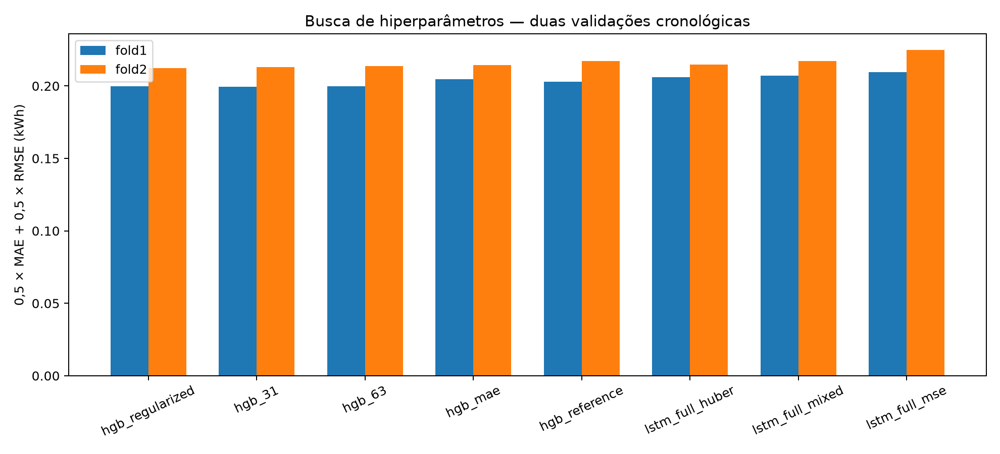
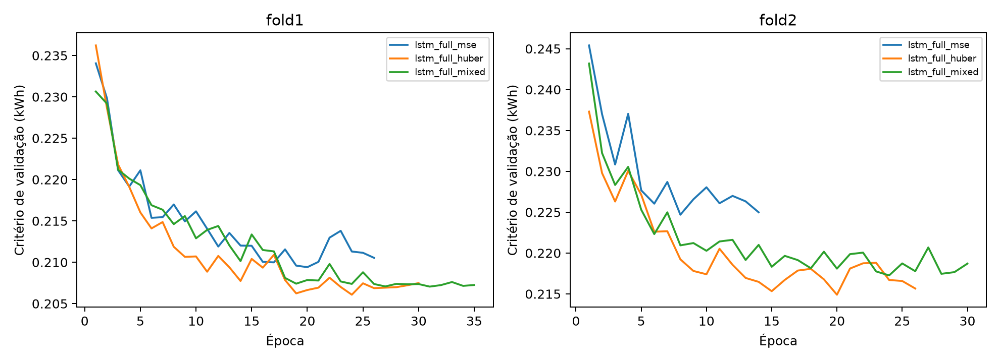
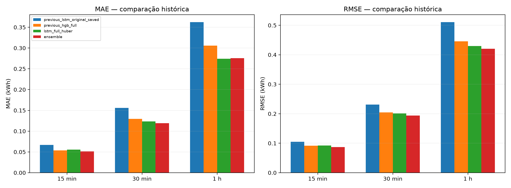
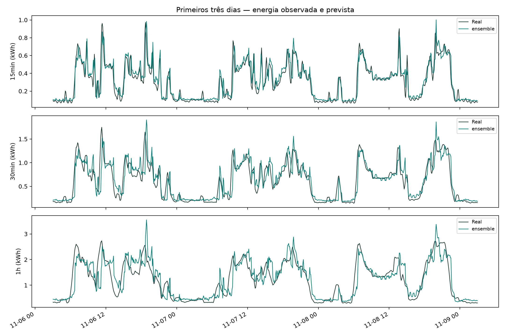

# Retreinamento e ajuste de hiperparâmetros em kWh

**Modelo escolhido pela validação: ensemble. Melhor rede: lstm_full_huber.**
O resultado anterior e os modelos antigos foram preservados em suas pastas.

## Protocolo

A busca avaliou cinco configurações de HistGradientBoosting e três da LSTM,
cada uma em dois períodos cronológicos consecutivos. São 16 ajustes de busca,
seguidos do retreinamento final das configurações de árvore e rede selecionadas.
Não foram usados alvos futuros como entrada, nem interpoladas medições ausentes.
As janelas afetadas por dados ausentes foram excluídas.

O critério fixado antes da busca foi a média, entre horizontes, de
**0,5 × MAE + 0,5 × RMSE, ambos em kWh**. Os dois períodos têm o mesmo peso.
Não se divide o erro pela duração do horizonte: os erros de 1 hora, naturalmente
maiores em kWh, têm maior influência absoluta neste critério que no experimento anterior.
O objetivo e a escolha da melhor época da rede passam a considerar a unidade física.

As fronteiras iniciais dos dois períodos de validação são
2010-09-25 09:03:00 e 2010-10-16 05:03:00.
O conjunto final contém 5,965 previsões, de
2010-11-06 03:03:00 até 2010-11-26 20:03:00.
Os alvos de uma janela de treino terminam antes do início da validação correspondente.

**Limite da avaliação:** o período de teste já havia sido examinado na análise anterior.
Ele é uma comparação histórica, não um novo teste independente. A seleção desta busca
usou somente as duas validações, e foi salva em `selection.json` antes da comparação
final. Confirmação independente exige dados ainda não examinados. Os resultados se
referem a uma residência e uma semente.

## O que foi ajustado

- Árvores: 15/31/63 folhas, 200–600 iterações, taxas 0,04–0,08,
  regularização L2 de 5–20, mínimo de 40–100 observações por folha e perdas MSE/MAE.
- Entradas das árvores: contexto anterior e, nas variantes ampliadas, trajetória
  da potência nos 24 blocos observados, tendência, médias recentes e amplitudes.
- Redes: LSTM de 32/64 unidades, camadas densas de 96/48/3, dropout de 10%/15%,
  taxas 0,0007/0,001 e perdas MSE, Huber ou mista calculadas em kWh.
- Parada antecipada e redução da taxa orientadas pelo critério de validação em kWh.
- Teste de combinações entre a melhor árvore e a melhor rede com pesos predefinidos
  de 25%, 50% e 75% para a árvore; a combinação só é escolhida se melhorar a validação.
- O PCA anterior não trouxe ganho preditivo; esta busca manteve as medições originais
  e as features causais. PCA continua disponível no diagnóstico anterior.
- Treino cobre o histórico completo disponível antes de cada partição, com janelas
  a cada 30 minutos; validações/teste usam cinco minutos.

## Busca na validação

| model | fold1 | fold2 | mean_kwh |
| --- | --- | --- | --- |
| hgb_regularized | 0.1996 | 0.2124 | 0.2060 |
| hgb_31 | 0.1996 | 0.2131 | 0.2063 |
| hgb_63 | 0.1997 | 0.2139 | 0.2068 |
| hgb_mae | 0.2047 | 0.2145 | 0.2096 |
| hgb_reference | 0.2028 | 0.2171 | 0.2099 |
| lstm_full_huber | 0.2061 | 0.2149 | 0.2105 |
| lstm_full_mixed | 0.2071 | 0.2173 | 0.2122 |
| lstm_full_mse | 0.2094 | 0.2247 | 0.2170 |

Combinações da melhor árvore com a melhor rede, avaliadas nas mesmas validações:

| Peso da árvore | Peso da LSTM | Critério médio (kWh) |
| --- | --- | --- |
| 0.2500 | 0.7500 | 0.2055 |
| 0.5000 | 0.5000 | 0.2031 |
| 0.7500 | 0.2500 | 0.2033 |




## Configuração final e retreinamento

```json
{
  "tree": {
    "name": "hgb_regularized",
    "max_iter": 600,
    "max_leaf_nodes": 31,
    "learning_rate": 0.04,
    "min_samples_leaf": 100,
    "l2_regularization": 20.0,
    "loss": "squared_error",
    "enhanced": true
  },
  "network": {
    "name": "lstm_full_huber",
    "units": 64,
    "dropout": 0.15,
    "learning_rate": 0.001,
    "loss": "huber"
  },
  "final_neural_epochs": 22,
  "ensemble_tree_weight": 0.5
}
```

Depois da seleção, os dois modelos escolhidos foram ajustados novamente em
**66,894 janelas de todo o histórico anterior ao teste, incluindo
os períodos de validação**. O número de épocas final foi fixado pela média das
melhores épocas dos dois períodos. A sequência de taxas de aprendizado da segunda
validação foi reaplicada; não houve parada antecipada nem ajuste pelo teste.

O resultado final combina efeitos dos hiperparâmetros, features e inclusão da
validação no retreinamento. Não se deve atribuir todo o ganho exclusivamente a
uma dessas mudanças. As duas validações controlam melhor a comparação dos candidatos.

## Métricas no período histórico

| model | horizonte | MAE | RMSE | MAPE_% | WAPE_% | R2 |
| --- | --- | --- | --- | --- | --- | --- |
| hgb_regularized | 15min | 0.0507 | 0.0876 | 19.4490 | 16.6602 | 0.8548 |
| hgb_regularized | 30min | 0.1233 | 0.1984 | 24.0766 | 20.2749 | 0.7956 |
| hgb_regularized | 1h | 0.2956 | 0.4348 | 29.9711 | 24.2959 | 0.7193 |
| lstm_full_huber | 15min | 0.0556 | 0.0925 | 22.7614 | 18.2830 | 0.8382 |
| lstm_full_huber | 30min | 0.1236 | 0.2011 | 23.8319 | 20.3186 | 0.7900 |
| lstm_full_huber | 1h | 0.2744 | 0.4299 | 26.2989 | 22.5495 | 0.7256 |
| ensemble | 15min | 0.0512 | 0.0869 | 20.4395 | 16.8242 | 0.8571 |
| ensemble | 30min | 0.1189 | 0.1936 | 23.2710 | 19.5560 | 0.8052 |
| ensemble | 1h | 0.2758 | 0.4203 | 27.3644 | 22.6680 | 0.7378 |
| previous_lstm_original_saved | 15min | 0.0670 | 0.1049 | 31.7181 | 22.0366 | 0.7916 |
| previous_lstm_original_saved | 30min | 0.1561 | 0.2314 | 36.8924 | 25.6584 | 0.7219 |
| previous_lstm_original_saved | 1h | 0.3623 | 0.5107 | 42.8532 | 29.7714 | 0.6128 |
| previous_hgb_full | 15min | 0.0534 | 0.0913 | 20.7432 | 17.5759 | 0.8421 |
| previous_hgb_full | 30min | 0.1293 | 0.2046 | 25.6073 | 21.2605 | 0.7825 |
| previous_hgb_full | 1h | 0.3056 | 0.4459 | 31.4450 | 25.1174 | 0.7048 |
| previous_lstm_features | 15min | 0.0611 | 0.0998 | 25.5320 | 20.1012 | 0.8114 |
| previous_lstm_features | 30min | 0.1392 | 0.2140 | 28.9749 | 22.8874 | 0.7622 |
| previous_lstm_features | 1h | 0.3148 | 0.4565 | 34.5214 | 25.8724 | 0.6906 |




### Alterações em relação à análise anterior

Valores positivos indicam redução do erro; negativos indicam piora.

| model | reference | horizonte | MAE_reduction_pct | RMSE_reduction_pct |
| --- | --- | --- | --- | --- |
| ensemble | previous_hgb_full | 15min | 4.2764 | 4.8515 |
| ensemble | previous_hgb_full | 30min | 8.0175 | 5.3704 |
| ensemble | previous_hgb_full | 1h | 9.7518 | 5.7563 |
| lstm_full_huber | previous_hgb_full | 15min | -4.0235 | -1.2495 |
| lstm_full_huber | previous_hgb_full | 30min | 4.4303 | 1.7420 |
| lstm_full_huber | previous_hgb_full | 1h | 10.2236 | 3.5938 |

Também estão salvas as comparações com a LSTM original e com a LSTM da análise
anterior em `improvements.csv`. As previsões completas estão em `test_predictions.csv`.

## Arquivos e reprodução

- `final/model_config.json`: configuração e identificação do modelo selecionado.
- `final/hgb_regularized.joblib`: árvore retreinada.
- `final/lstm_full_huber.keras` e `final/lstm_full_huber_transforms.joblib`: rede e transformadores.
- `search_trials.csv`, `validation_ranking.csv` e `fold*/`: histórico da busca.
- `manifest.json`: parâmetros, versões e hashes dos dados, código e referência.
- `prepared_samples.joblib`: cache das janelas para retomada da busca.

```powershell
.\.venv\Scripts\python.exe tune.py --output outputs/experiments/nova_busca --reference "C:\Users\jhona\Documents\Jhonatan\Ciência de Dados\PI4\outputs\experiments\2026-09-26" --epochs 35 --train-stride 30
.\.venv\Scripts\python.exe -m unittest discover -s tests -v
```

Use uma pasta nova. Para retomar uma busca interrompida, use a mesma pasta e os
mesmos parâmetros com `--resume`; os ajustes concluídos são reaproveitados.
